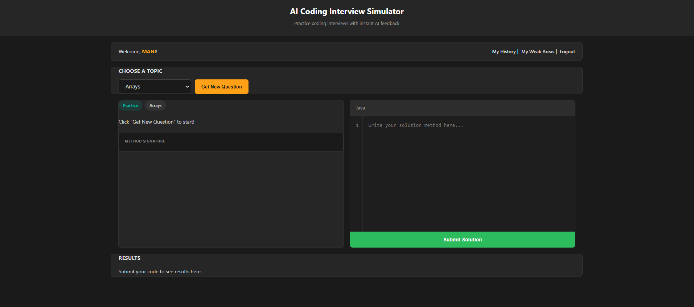
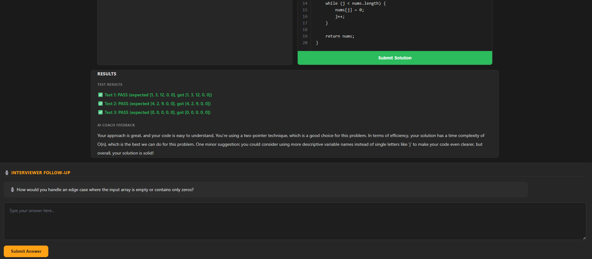

\# 🎯 AI Coding Interview Simulator

> A full-stack web app that helps students practice coding interviews with an AI that generates unlimited fresh questions, judges code correctness, asks live follow-up questions like a real interviewer, and tracks weak areas over time.

Built as a solo full-stack project — from database design to AI prompt engineering to UI — to simulate the experience of a real technical interview, not just a static problem bank.

---

## ✨ What Makes This Different

Most practice platforms give you a fixed question bank and a pass/fail judge. This project goes further:

- 🎙️ **Live interviewer follow-ups** — after you submit code, the AI asks a natural follow-up question (e.g. about time complexity or edge cases) and evaluates your answer, just like a real interview conversation.
- 📈 **Weak-area tracking** — your submission history is analyzed per topic, and the AI generates a personalized coaching summary pointing out your strongest and weakest areas.
- ♾️ **Unlimited, varied questions** — a curated bank of 100+ problem seeds (mixing beginner basics with placement-level difficulty) combined with AI-generated wording and test cases, so no two sessions feel the same.
- 🛡️ **Safe code execution** — student code runs in an isolated process with strict timeouts, protecting the server from infinite loops or bad input.

---

## 🖼️ Screenshots

<!-- Add your screenshots here after pushing. Example: -->
<!--  -->
<!--  -->
<!--  -->

---

## 🧱 Tech Stack

| Layer | Technology |
|---|---|
| Frontend | HTML, CSS, JavaScript (vanilla) |
| Backend | Java, Spring Boot |
| Database | MySQL |
| AI | Groq API (Llama 3.3 70B) |
| Auth | BCrypt password hashing |

---

## 🏗️ Architecture

```
┌─────────────┐      HTTP/JSON      ┌──────────────────┐      SQL       ┌─────────┐
│  Frontend   │ ──────────────────▶ │  Spring Boot API  │ ─────────────▶ │  MySQL  │
│ (HTML/JS)   │ ◀────────────────── │                    │ ◀───────────── │         │
└─────────────┘                      └──────────────────┘                └─────────┘
                                              │
                                              ▼
                                      ┌──────────────┐
                                      │   Groq AI    │
                                      │ (Llama 3.3)  │
                                      └──────────────┘
```

**Key backend components:**
- `QuestionGeneratorService` — picks a random problem from a curated bank per topic, asks AI to generate full details + test cases
- `CodeRunnerService` — compiles and runs submitted code in an isolated process with a timeout
- `AiFeedbackService` — AI reviews code style, efficiency, and approach
- `InterviewerService` — generates live follow-up questions and evaluates answers
- `WeakAreaService` — aggregates submission history into per-topic stats + AI summary

---

## 🚀 Features

- User authentication (signup/login) with hashed passwords
- 9 topics: Arrays, Strings, Loops, Recursion, Sorting, Searching, Math, Matrix, Bit Manipulation
- Real-time code compilation and test-case judging
- AI-generated coaching feedback on every submission
- Live interviewer follow-up Q&A
- Submission history with pass/fail tracking
- Per-topic weak-area analysis with personalized AI insights
- Rate limiting to prevent API abuse

---

## 🛠️ Getting Started (Run Locally)

### Prerequisites
- Java 21+
- MySQL 8+
- A [Groq API key](https://console.groq.com) (free tier available)

### Setup

1. **Clone the repo**
   ```bash
   git clone https://github.com/YOUR_USERNAME/ai-coding-interview-simulator.git
   cd ai-coding-interview-simulator
   ```

2. **Set up the database**
   ```sql
   CREATE DATABASE ai_interview_simulator;
   ```

3. **Configure the backend**

   Create `backend/src/main/resources/application.properties`:
   ```properties
   spring.datasource.url=jdbc:mysql://localhost:3306/ai_interview_simulator
   spring.datasource.username=root
   spring.datasource.password=YOUR_MYSQL_PASSWORD
   spring.jpa.hibernate.ddl-auto=update
   groq.api.key=YOUR_GROQ_API_KEY
   ```

4. **Run the backend**
   ```bash
   cd backend
   ./mvnw spring-boot:run
   ```

5. **Run the frontend**

   Open `frontend/index.html` with a local server (e.g. VS Code's Live Server extension).

---

## 🗺️ Roadmap

- [ ] Time complexity (Big-O) analysis of submitted code
- [ ] "Explain your approach first" mode before coding
- [ ] Deploy to production (frontend + backend + DB)
- [ ] Support additional languages beyond Java

---

## 📄 License

This project is open source and available under the [MIT License](LICENSE).

---

## 👤 Author

Built by **MANIKANDAN S** as a full-stack learning project.
